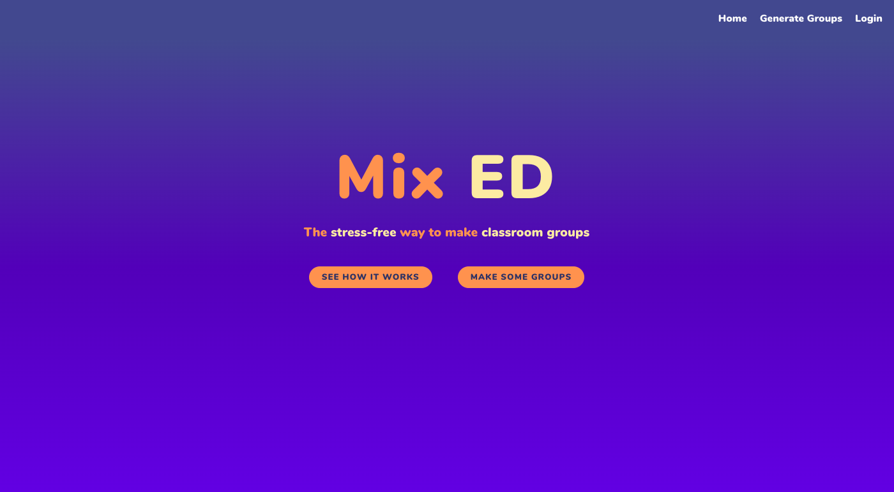
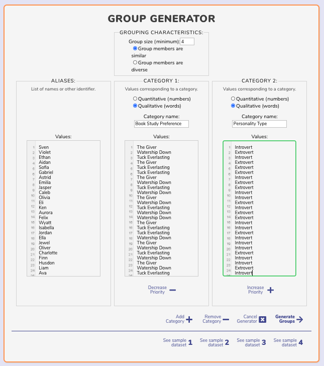
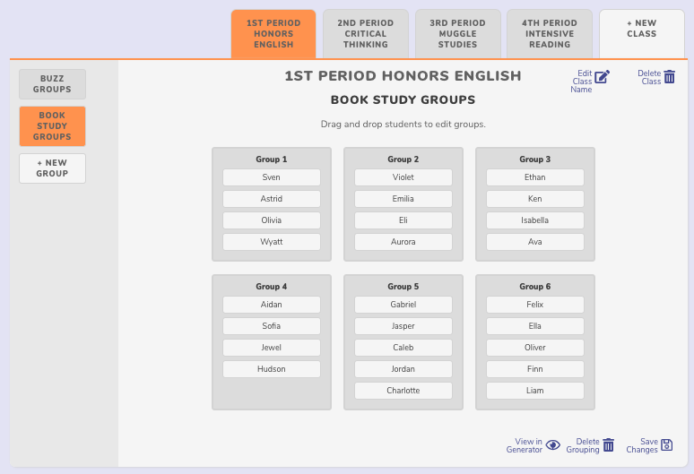

# Mix Ed takes the headache out of forming groups in the classroom.

[Mix Ed](https://mixed-app.vercel.app/) is a group generator app that allows teachers to create homogeneous or heterogeneous student groups based on student data. Teachers input students' names (or other identifier, such as a number) and decide what kinds of categories they'd like to form groups based upon (for instance, test scores, personality type, topic of interest, or favorite book), then provide a value for each student within that category. Then, teachers can decide on group size and whether students within each group should be similar or whether they should be different from each other, and click generate. Generated groupings can be saved according to class for easy access or editing later on.

See Mix Ed in action here: <https://mixed-app.vercel.app/>

## Features
- Generate groups
- Rearrange groups
- Save generated groups

## Demo user login

To try the app out, the demo consumer login can be used as follows:

username: msmith
password: password

## Screenshots

## Built with
- Node.js
- Express.js
- PostgreSQL

## Farmpicks Client
See the FarmPicks Client Repo at <https://github.com/rise-erpelding/mixed-app>

## Setting Up API

- Install dependencies: `npm install`
- Create development and test databases: `createdb mixed`, `createdb mixed-test`
- Create database user: `createuser mixed`
- Grant privileges to new user in `psql`:
  - `GRANT ALL PRIVILEGES ON DATABASE mixed TO mixed`
  - `GRANT ALL PRIVILEGES ON DATABASE "mixed-test" TO mixed`
- Prepare environment file: `cp example.env .env`
- Replace values in `.env` with your custom values.
- Bootstrap development database: `npm run migrate`
- Bootstrap test database: `npm run migrate:test`

## Sample Data

- To seed the database for development: `psql -U mixed -d mixed -a -f seeds/seed.sample.sql`
- To clear seed data: `psql -U mixed -d mixed -a -f seeds/trunc.sample.sql`

## Scripts

- Start application for development: `npm run dev`
- Run tests: `npm test`

## Endpoints

### GET /api/teachers
#### Description
Retrieves all teachers' (users') information.
#### Authorization
Required.

### GET /api/classes
#### Description
Retrieves all classes in the database.
#### Authorization
Required.

### POST /api/classes
#### Description
Adds a new class with specified class_name for the currently authorized teacher/user.
#### Authorization
Required.

### GET /api/classes/teacher
#### Description
Retrieves all classes in the database for the currently authorized teacher/user.
#### Authorization
Required.

### GET /api/classes/:id
#### Description
Retrieves class with specified id.
#### Authorization
Required.

### DELETE /api/classes/:id
#### Description
Removes class with specified id.
#### Authorization
Required.

### PATCH /api/classes/:id
#### Description
Updates class with specified id to specified class_name.
#### Authorization
Required.

### GET /api/groupings
#### Description
Retrieves all groupings in the database.
#### Authorization
Required.

### POST /api/groupings
#### Description
Adds a new grouping with specified grouping_name, groupings (explaining which students are in which group), data (the raw data entered into the generator as React state), and class_id for the currently authorized teacher/user.
#### Authorization
Required.

### GET /api/groupings/teacher
#### Description
Retrieves all groupings in the database for the currently authorized teacher/user.
#### Authorization
Required.

### GET /api/groupings/:id
#### Description
Retrieves grouping with specified id.
#### Authorization
Required.

### DELETE /api/groupings/:id
#### Description
Removes grouping with specified id.
#### Authorization
Required.

### PATCH /api/groupings/:id
#### Description
Updates grouping with specified id to specified grouping_name, groupings, data, or class_id.
#### Authorization
Required.